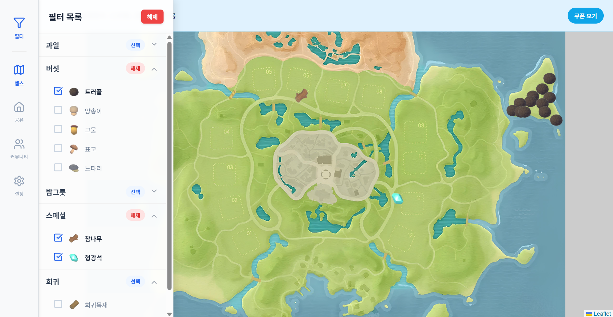

# DUDUTA-MAPS
두근두근타운의 재료를 표시해주는 맵스

## 프로젝트 소개
원신맵스를 오마주하여 만든 재료표시 사이트

## MVP 개발기간 
* 2026.01.10 ~ 2026.01.14

### 개발자
 - 1인개발 김민서 : 기획 개발 및 배포

 ### 개발환경
 - React + Vita
 - IDE : VsCode / Curser
 - DB : Firebase
 - 배포 : Vercel

### 주요 기능
- 재료를 필터링하여 위치를 확인
- 커뮤니티로 친구찾기 및 모임구성(LocalStorage방식)

### 사이트 링크
<https://duduta.kro.kr/>

